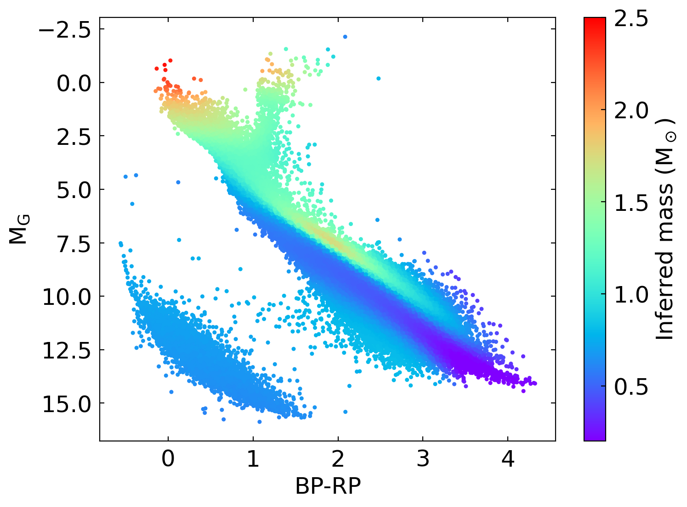

# Dynamical masses across the Hertzsprung-Russell diagram

In Hwang+23, we measure the dynamical masses across the Hertzsprung-Russell (H-R) diagram using the wide binary stars. Specifically, the Gaia telescope has measured wide binaries' orbital motion, which provides mass information. Using these wide binaries as a training sample, we develop a neural network approach to measure the mass of stars at every point of the H-R diagram (as shown in the plot above!). 

Here we provide the source codes we developed to train and load the model. In the Jupyter notebook "Demo 0-Load the trained model.ipynb", we show how to load the trained model from the paper ("trained_model_20230809.pth") and obtain the mass value at a specific point of the H-R diagram. In the notebook "Demo 1-Train your own model in a few minutes!.ipynb", we demonstrate how to use the codes to train your own neural network model for the mass of the H-R diagram, which can take as short as a few minutes!

These codes are based on Python and the machine learning library PyTorch, and are mainly developed and tested on the Google Colab platform. Google Colab platform provides free GPU access (at the time of writing), which accelerates the codes significantly. Therefore, we highly recommend running the codes using Google Colab (i.e. you will place these files in your Google Drive, and then use Colab to open these notebooks). It is possible to run the codes on other platforms or even without GPU, but some parts of the codes may not be fully functional. Feel free to contact me if you have any suggestions or comments! 

## Reference
Hwang, Ting, Cheng, & Speagle, 2023, in preparation
